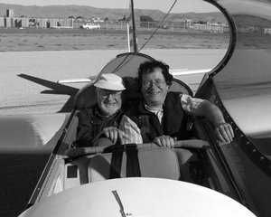
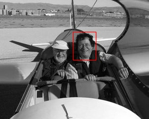

# GoCV-Template-Matching
Converted [Python Template Matching tutorial](https://docs.opencv.org/3.0-rc1/de/da9/tutorial_template_matching.html) into GoLang code 

## Theory
**What is template matching?**

Template matching is a technique for finding areas of an image that match (are similar) to a template image (patch).

**How does it work?**

We need two primary components:

1. **Source image (I):** The image in which we expect to find a match to the template image
2. **Template image (T):** The patch image which will be compared to the template image

Our goal is to detect the highest matching area.

## Code
**What does this program do?**
* Loads an input image and a image patch (*template*)
* Perform a template matching procedure by using the OpenCV function `func MatchTemplate(image Mat, templ Mat, result *Mat, method TemplateMatchMode, mask Mat)` with any of the matching methods (Ccoeff, CcoeffNormed, Ccorr, TmCcorrNormed, Sqdiff, or TmSqdiffNormed)
* Normalize the output of the matching procedure
* Localize the location with higher matching probability
* Draw a rectangle around the area corresponding to the highest match

## Results
1. Testing our program with an input image such as:

 

2. And a template image:

 

3. Gives us the match shown below:

 

----

## Thanks
* [GoCV library](https://github.com/hybridgroup/gocv)
* [OpenCV Documentation](https://docs.opencv.org/3.0-rc1/de/da9/tutorial_template_matching.html)
